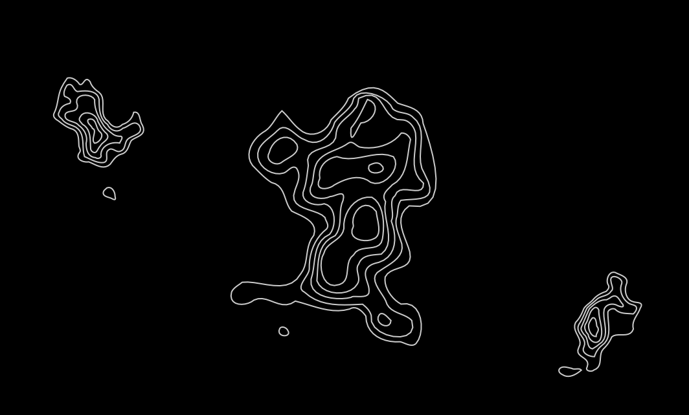
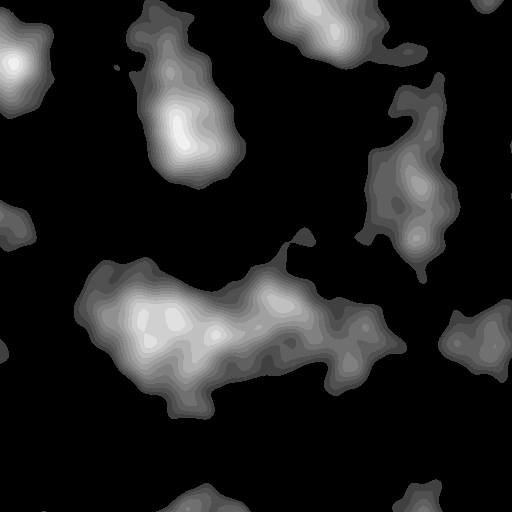
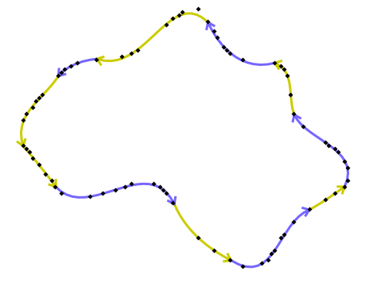
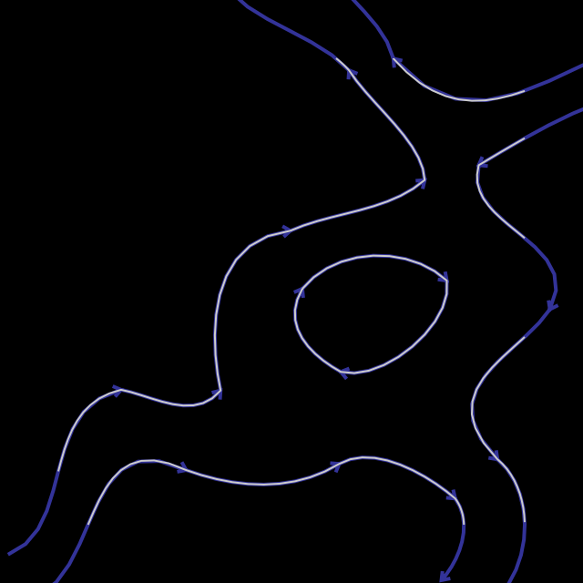
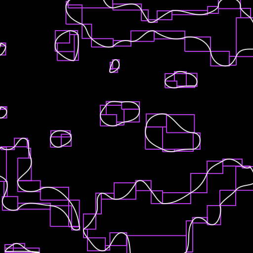

# Tactical Situation Plotting Tool

A C++ plotting tool that began as a way to work out a submarine's tactical situation in a video game by hand: bearings, ranges, courses and distance-over-time along a track. It grew into a small vector-graphics engine that converts raster terrain heightmaps into smooth, layered Bézier contours, giving cleaner and more readable maps than the source pixels.

Rendering uses [Anti-Grain Geometry](https://agg.sourceforge.net/antigrain.com/) (AGG 2.5) for anti-aliased scanline output. [Irrlicht](https://irrlicht.sourceforge.io/) provides the window, input and display. The project builds with GCC through Code::Blocks on Windows.

## Features

**Plotting tools**
- **Ruler:** measures a line, with labelled length and subdivision ticks.
- **Circle / range:** draws a radius with its length labelled.
- **Waypoint paths:** multi-leg tracks with indexed points.
- **Scatter points:** standalone marks.
- **Compass:** a screen-space bearing rose that follows the cursor.
- **Protractor:** measures the angle between consecutive legs.
- **Interval markers:** ticks at fixed distances along a path, measured from either the start or the end. Intervals step from 1 to 1000. Useful for plotting speed × time.
- **Editing:** hover a point to select it, then drag or delete it. Per-path styles (markers, lines, labels, colour) cycle from the keyboard.
- **Navigation:** pan and zoom, with grid spacing that adapts to the zoom level.
- **Export:** BMP export of the current view.

**Terrain**
- Procedural heightmaps built from three octaves of Perlin noise.
- Six nested elevation levels traced into closed Bézier outlines and drawn as layered filled shapes.

## How the terrain vectorization works

1. **Heightmap.** Gradient (Perlin) noise with a quintic fade curve. Octaves on 8-, 16- and 32-cell grids are summed and rescaled into a 1024×1024 map.

2. **Region isolation.** Each elevation threshold produces a binary mask. A recursive scanline flood fill separates connected regions and discards tiny ones.

3. **Boundary tracing.** A four-direction state machine walks each region's pixel boundary to produce an ordered polyline. The polyline is then resampled: points are inserted across long gaps and near-duplicates are dropped.

4. **Sub-pixel edge refinement.** At each boundary pixel, a least-squares cubic is fitted to nine heightmap samples along the row and along the column. The contour height is subtracted, and the cubic is solved for its zero crossing. This places the edge at a fractional offset instead of on the pixel grid, using whichever axis gives the smaller correction. Cubics are solved with S. I. Khashin's `poly34` routines.

5. **Bézier fitting.** Runs of boundary points are fitted with cubic Béziers by linear least squares, using chord-length parameterization:
   `C = M⁻¹ (TᵀT)⁻¹ Tᵀ P`.
   Here `T` holds the powers of the parameter, `M` is the Bernstein basis matrix and `P` holds the points. The matrix code is small and hand-written.

   The fitting is adaptive. It tries up to 14 points per curve. If the summed error exceeds the tolerance, it cuts at the worst-fitting point and refits. Adjacent endpoints are then joined, and segments along the map edge become straight lines.

6. **Analytic bounding boxes.** Each curve's extent comes from the roots of its quadratic derivative, not from sampling. These boxes drive culling and hit-testing.

## Rendering and clipping

Filled shapes must stay closed when only part of them is on screen, so curves are clipped against the viewport analytically:

- **Finding the crossings.** Each Bézier's x(t) or y(t) is converted to power form, and a cubic is solved for where it crosses each viewport edge.
- **Ordering them.** Every crossing is given a position on the viewport perimeter, a single 0–4 coordinate running around the four sides. The crossings are then sorted.
- **Closing the shapes.** The visible intervals are paired recursively, and the right screen corners are spliced in between them so the filled region closes correctly.

Circles and arcs are clipped the same way, using closed-form `asin`/`acos` intersections.

Curve tessellation adapts every frame to a vertex budget. The step count drops when a frame produces too many vertices and rises when it produces few, which keeps panning and zooming responsive.

## Gallery

| | |
|---|---|
|  |  |
|  |  |

## Building

The project file is `Drawing.cbp` (Code::Blocks, GCC). You'll need:
- AGG 2.5 sources. The project references them at a relative path; adjust it if yours differ.
- Irrlicht headers and library. `Irrlicht.dll` must sit next to the executable.
- Windows, since the text renderer uses Win32 TrueType fonts.

## Credits

- Cubic and quartic solvers: S. I. Khashin (`poly34.cpp`).
- Rendering: Anti-Grain Geometry by Maxim Shemanarev.
- Windowing and input: the Irrlicht Engine.
